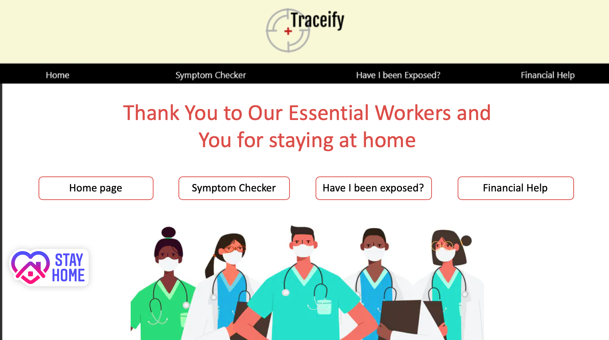
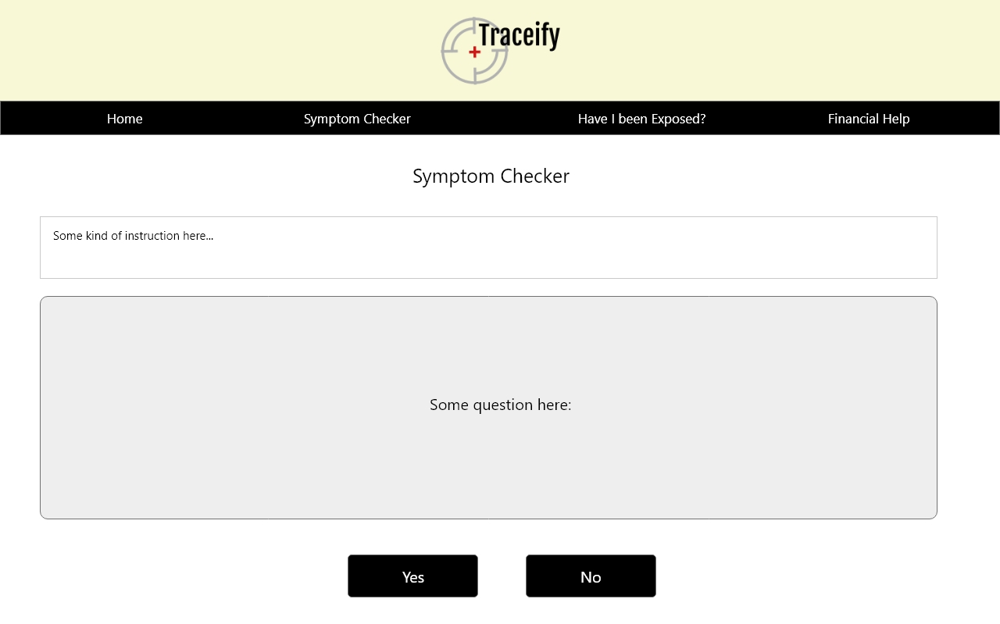
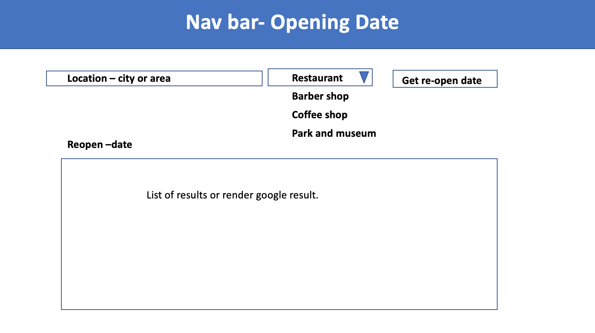

# Traceify

**Collaborators (CSID)**: e5c0b, d2e2b, l0y2b, k0b0b &nbsp;  
**Course**: CPSC 436I &nbsp;  
**Lab section**: Thursday L1C &nbsp;  
**May - August 2020**. &nbsp;  
**Project Name**: Traceify  
**Team Name**:ControlC 

## Tech Stack
- HTML
- CSS
- JS
- React
- Redux
- NodeJS
- NoSQL (mongodb)

## License
TBA

## Project Description
https://docs.google.com/document/d/18EIdx1Ytu0IXqTDAZWKWwrnbv4uQwJ7OXPdo-ErhpIc/edit?usp=sharing  

Our project aims to help the general public in BC by providing information and keeping track of where COVID-19 positive individuals visited within the last three days. The users will be able to view the locations and the infected number of people. In addition, the search can be filtered by a region on a Google Map. 

*	Who is it for?
    - The general public.  
    
*	What will it do? (What "human activity" will it support?)
    - It will keep track of COVID-19 positive individuals of where they have visited in 3 day intervals. (Reason for that: some RNA test may need 3-4 days to complete and if a result is positive, the infected person is a carrier that can potentially infect others during this 3 days window)   
    
*	What type of data will it store?
    - Dates and Location of where people who turned out positive visited for the last 3 days
    - For a detailed description, refer to the Database Schema section below  
    
*	What will users be able to do with this data?
    - View map, locations, and infected numbers per region
    - Filter out by location or date or region
    - If you find yourself at risk, you can isolate yourself at home for 2 weeks
    - You can avoid traveling to locations where there's higher chance of transmission  
    
*	What is some additional functionality you can add/remove based on time constraints?
    - Symptom checker: Upon clicking radio buttons, the javascript or library package would calculate whether you would need to go to a clinic for check up or not. 
    We can decide on the next question according to user’s input instead of listing all the possible symptoms.  
    Our first question can be "Are you experiencing severe breathing difficulties", and if the user answers yes, we should give suggestion about calling 811 or redirect to bc health website. 
    If not, we can continue questionnaires with other possible mild symptoms. And when they finish the checker process, we will give suggestions or redirect the user to a certain page.  
    https://drive.google.com/file/d/1oiruC1mYAAFN7DtbwOGw02uMucLj5MDP/view?usp=sharing this is the visio online version of how we are going to direct people  
    https://bc.thrive.health/covid19/en example of symptom checker

##	 Project Task Requirements:

*	3-5 minimal requirements (will definitely complete)
    - Admin panel: Admin can submit anonymous patient data to be stored on the database
    - Home page: Google Maps integration to show data on map based on the filter selected
    - Symptom Checker page
    - A thank you pape for all essential workers and people stay at home
     
    
*	3-7 "standard" requirements (will most likely complete)
    - Have I Been Exposed? page
    - Financial Help page (links to CERB, EI, BC Emergency Workers fund, etc.)
    - Retailers Re-Opening Dates
    - (Historical data visulization), so people can see if the curve has been flattern 
     
    
*	2-3 stretch requirements (plan to complete 1)
     - Q&A page
     - Wait times of testing centres (employ same technology currently used in all major hospitals: see     http://www.edwaittimes.ca/WaitTimes.aspx)
    - Location of testing centres - list and map : https://experience.arcgis.com/experience/3862560c5a41418e9d78f4f81688e9d0 something  like this
    - Current geolocation data only visible to Admin: alerts if the person moves out of their neighbourhood
    - Credit card statement parsing for areas visited by a patient who tested positive, and automatically upload this data to the database
 

## Task Breakdown
○ Pick 2 of your minimal requirements and break each of them down into ~2-5 smaller tasks! This will help you divide up work among your teammates. 

* Set-up the database (create mock data, write scripts to populate the database, etc.)
* Implement Front-end of Admin panel
* Implement Back-end of Admin panel
* Implement Front-end of Home page. Research Google Map API and render dots on a map appropriately
* Implement Back-end of Home page
 

## Prototypes

    

## Database Schema

* Visited (<ins>carecard: integer, date: Date, location: char(50)</ins>)  
Reason for having all 3 as primary keys:  
Case1: need care card b/c there could be overlapping date/location with a different person. Case2: he/she could’ve visited the same location for two consecutive days  
Foreign key: location references Location_isIn

* Location_isIn (<ins>location: char(50)</ins>, regionName: char(20))  
Ex) (“4700 Kingsway, Burnaby, BC V5H 4N2”, “Burnaby”) or (“4700 Kingsway, Burnaby, BC V5H 4N2”, “Metrotown”)  
Foreign key: regionName references Region

* Region (<ins>regionName: char(20)</ins>)

* Symptom (<ins>symptom: char(20)</ins>)

* Diagnosis (<ins>illness: char(20)</ins>, symptom: char(20)) 
Foreign key: symptom references Symptom

